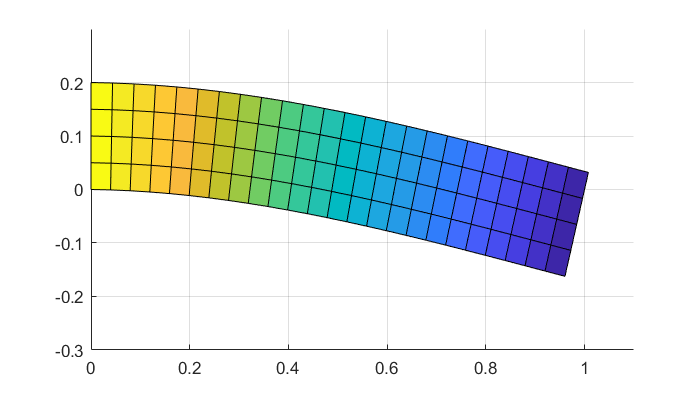

## Examples

These examples start simple and demonstrate how to use the various aspects of finch.

<h3>Poisson</h3> 

 
The simplest example possible. 1D Poisson with homogeneous Dirichlet boundary. It demonstrates the basics of setting up and solving a problem directly in finch.
 Page: <a href="https://paralab.github.io/finch/pages/poisson1d.html">poisson 1D page</a>
 Script: <a href="https://github.com/paralab/finch/blob/master/src/examples/example-poisson1d.jl">example-poisson1d.jl</a>

<h3>Linear Elasticity</h3>

 
The linear elasticity example demonstrates vector entities and mixed boundary conditions.
 Page: <a href="https://paralab.github.io/finch/pages/elasticity.html">elasticity page</a>
 <a href="https://github.com/paralab/finch/blob/master/src/examples/example-elasticity.jl">example-elasticity.jl</a>

<h3>Heat</h3>

 
The heat equation demonstrates support for time dependent problems.
 Page: <a href="https://paralab.github.io/finch/pages/heat.html">heat page</a>
 <a href="https://github.com/paralab/finch/blob/master/src/examples/example-heat2d.jl">example-heat2d.jl</a>

<h3>Navier Stokes</h3>

 
This 2D lid-driven NS problem demonstrates some of the nonlinear capabilities and the use of parameter entities.
 Page: <a href="https://paralab.github.io/finch/pages/NS.html">NS page</a>
 <a href="https://github.com/paralab/finch/blob/master/src/examples/example-NS.jl">example-NS.jl</a>

<h3>Unstructured Meshes</h3>

Unstructured meshes in 2D and 3D made of triangles, quadrilaterals, hexahedra and tetrahedra are imported from .MSH files and demonstrated on some simple problems.
 Page: <a href="https://paralab.github.io/finch/pages/unstructured.html">Unstructured Meshes page</a>
 <a href="https://github.com/paralab/finch/blob/master/src/examples/example-unstructured2d.jl">example-unstructured2d.jl</a>
 <a href="https://github.com/paralab/finch/blob/master/src/examples/example-unstructured3d.jl">example-unstructured3d.jl</a>

<h3>Finite Volume: Advection</h3>

Finite volume method for a basic advection problem. This example demonstrates the finite volume capability as well as exporting/importing generated code.
 Page: <a href="https://paralab.github.io/finch/pages/FVadvection.html">FV Advection page</a>
 <a href="https://github.com/paralab/finch/blob/master/src/examples/example-advection1d-fv.jl">example-advection1d-fv.jl</a>
 <a href="https://github.com/paralab/finch/blob/master/src/examples/example-advection2d-fv.jl">example-advection2d-fv.jl</a>

<h3>Indexed Variables</h3>

Finite volume method for an advection-diffusion problem using indexed variables to compute the same equation over many values of advection speed and diffusion rate. This example demonstrates indexed variables and customizable assembly code generation.
 Page: <a href="https://paralab.github.io/finch/pages/indexed.html">Indexed Variables page</a>
 <a href="https://github.com/paralab/finch/blob/master/src/examples/example-addiff1d-indexed.jl">example-addiff1d-indexed.jl</a>

