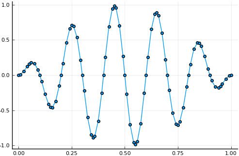

## 1D Poisson



The Julia script: <a href="https://github.com/paralab/finch/blob/master/src/examples/example-poisson1d.jl">example-poisson1d.jl</a>

The 1D Poisson equation with Dirichlet boundary and smooth functions is about as simple as it gets. This example demonstrates the basics of setting up a problem in Finch. A uniform discretization of the unit domain is used with p=4 polynomial basis function space.

Begin by loading the Finch module. Then initialize. The name here is only used when generating code files.
```
using Finch
init_finch("poisson1d");
```
Then set up the configuration. This example simply sets dimensionality of the domain and polynomial order of the basis function space.
```
domain(1)                  	# dimension
functionSpace(order=4) 		# polynomial order
```
Use the built-in simple mesh generator to make the mesh and set up all node mappings.
```
mesh(LINEMESH, elsperdim=20)# uniform 1D mesh with 20 elements
```
Define the variable, test function, and forcing function symbols.
```
u = variable("u")           # make a scalar variable u
testSymbol("v")             # sets the symbol for a test function
coefficient("f", "-100*pi*pi*sin(10*pi*x)*sin(pi*x) - pi*pi*sin(10*pi*x)*sin(pi*x) + 20*pi*pi*cos(10*pi*x)*cos(pi*x)")
```
Convert the PDE
<div align="center"> </div>
<div align="center"> </div>
into the weak form
<div align="center"> </div>

The boundary condition is specified.
```
boundary(u, 1, DIRICHLET, 0) # boundary condition for BID 1 is Dirichlet with value 0
```
Then write the weak form expression in the residual form. Finally, solve for u.
```
weakForm(u, "-grad(u)*grad(v) - f*v")
solve(u);
```
End things with `finalize_finch()` to finish up any generated files and the log.